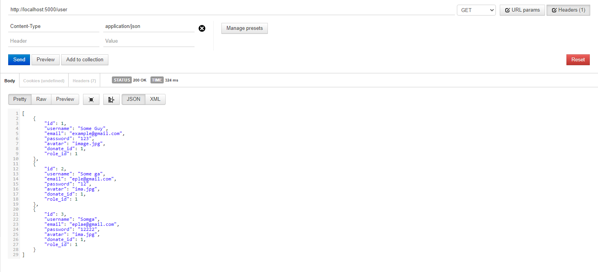
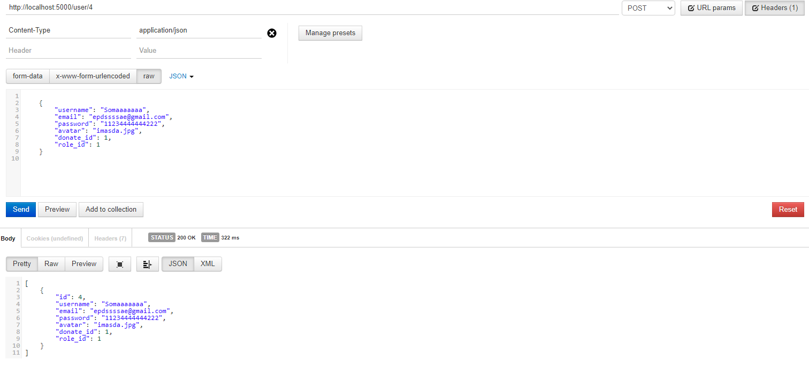
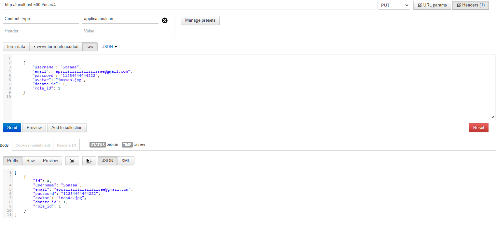
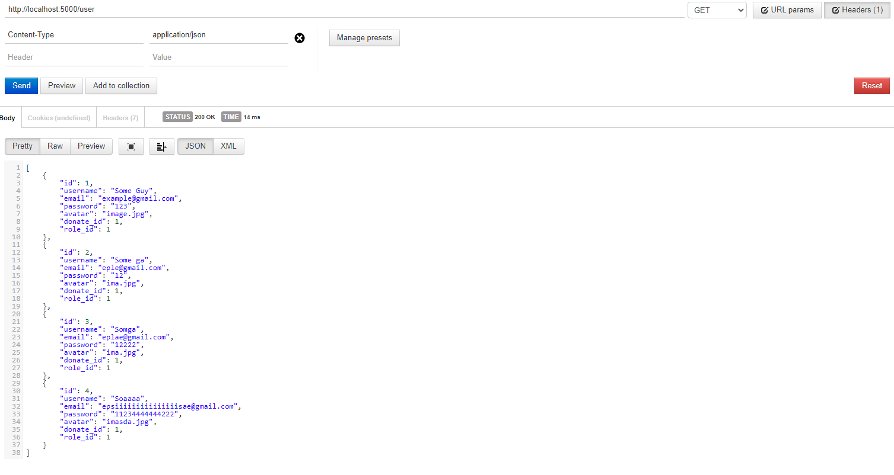
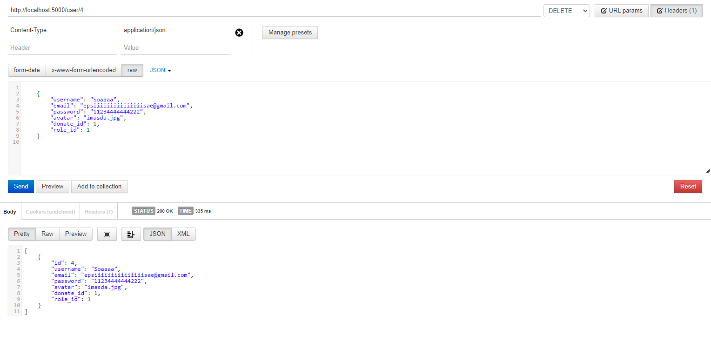
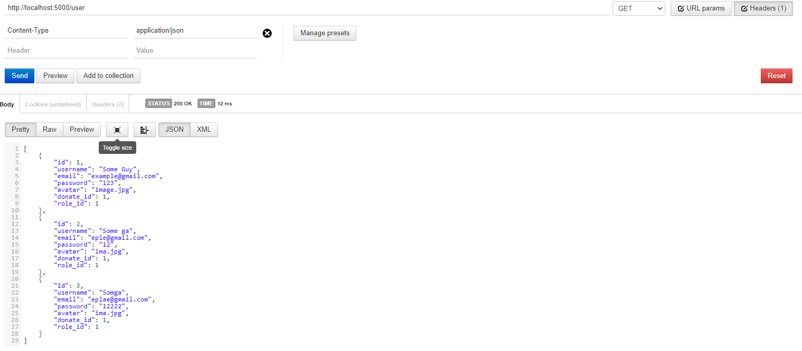

# Тестування працездатності системи

## Запуск сервера

## Перевірка даних (Get)

## Перевірка користувача 1 (Get:id)

## Створення нового користувача (POST)

## Перевірка

## Зміна параметрів користувача (PUT)

## Перевірка

## Видалення користувача (Delete)

## Перевірка

