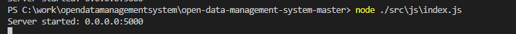

# Тестування працездатності системи

## Запуск сервера

## Перевірка даних (Get)

## Перевірка сутності 1 (Get:id)

## Створення нової сутності (POST)

## Перевірка

## Зміна параметрів сутності (PUT)

## Перевірка

## Видалення сутності (Delete)

## Перевірка

